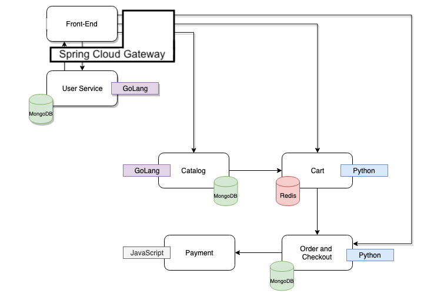

# Demo of ACME Fitness Shop

## Getting Started

These instructions will allow you to run entire ACME Fitness Shop

## Requirements

Based on the type of deployment the requirements will vary

1. **docker-compose** - Needs docker-compose version 1.23.1+
2. **kubernetes**
3. **AWS Fargate**

Other deployment modes coming soon

## Overview



## TL;DR for deploying to k8s

Install [Spring Cloud Gateway for kubernetes](https://docs.pivotal.io/scg-k8s/1-0/installation.html) before running the following command.

```
echo 'password=<value>' > kubernetes-manifests/.env.secret
kustomize build kubernetes-manifests/ | kubectl apply -f -
```

Note: `<value>` can be any value. It will be the password used by the deployed apps to access the deployed databases.

To visit the site, you may port-forward the gateway service:

```
kubectl port-forward service/gateway-acme 8080:80
```

Or add a DNS record to either a DNS registry or in your local `/etc/hosts`:

```
<your.ingress.ip.address>   gateway-acme.spring.animalrescue.online
```

If you'd like to use [API portal for VMware Tanzu](https://docs.pivotal.io/api-portal/1-0/installing.html) to view all the endpoints, you will need to install API portal with `api-portal-server.sourceUrls: "http://scg-operator.spring-cloud-gateway/openapi"` set in the helm values. The [gateway resource](./kubernetes-manifests/gateway.yaml) assumes API portal is using the URL `http://api-portal.spring.animalrescue.online`. To create an Ingress resource for your API portal with this URL, you may run:

```
kubectl apply -f kubernetes-manifests/api-portal-ingress.yaml # Assuming API portal is installed in `api-portal` namespace.
```

We deploy to `acme-fitness` namespace by default (kustomize will create that namespace as well). If you prefer a different namespace, you may change it in [kubernetes-manifests/kustomization.yaml](kubernetes-manifests/kustomization.yaml).

## Instructions

1. Clone this repository

2. You will notice the following directory structure

```text
├── README.md
├── acmeshop.png
├── aws-fargate
│   ├── README.md
│   ├── acme-fitness-shop.yaml
│   └── cf-template.png
├── docker-compose
│   ├── README.md
│   └── docker-compose.yml
├── kubernetes-manifests
│   ├── README.md
│   ├── gateway.yaml*
│   ├── api-portal-ingress.yaml*
│   ├── cart-redis-total.yaml
│   ├── cart-total.yaml
│   ├── cart-gateway-config.yaml*
│   ├── catalog-db-initdb-configmap.yaml
│   ├── catalog-db-total.yaml
│   ├── catalog-total.yaml
│   ├── catalog-v2-total.yaml
│   ├── catalog-gateway-config.yaml*
│   ├── frontend-total.yaml*
│   ├── frontend-gateway-config.yaml*
│   ├── order-db-total.yaml
│   ├── order-total.yaml
│   ├── order-gateway-config.yaml*
│   ├── payment-total.yaml
│   ├── users-db-initdb-configmap.yaml
│   ├── users-db-total.yaml
│   ├── users-total.yaml*
│   └── users-gateway-config.yaml*
└── traffic-generator
    ├── README.md
    ├── locustfile.py
    └── requirements.txt
```

The files marked with `*` are updated to work with Spring Cloud Gateway and API portal.

3. Switch to the appropriate directory for deployment

* [docker-compose](./docker-compose)
* [kubernetes-manifest](./kubernetes-manifests)
* [aws-fargate](./aws-fargate)

### Additional Info

The [traffic-generator](./traffic-generator) is based on **locust** and can be used to create various traffic patterns, if you need it for other demos associated with **Monitoring and Observability.**
